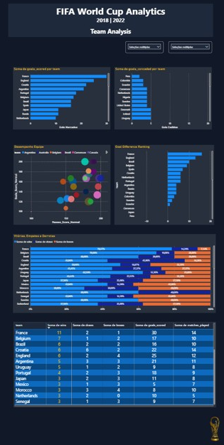
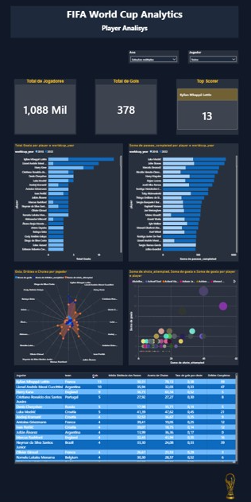

# ⚽ Plataforma Analítica das Copas do Mundo FIFA

### Projeto End-to-End de Engenharia de Dados


---

## 📌 Sobre o Projeto

Este projeto foi desenvolvido com o objetivo de construir uma plataforma analítica completa para análise das Copas do Mundo FIFA de **2018** e **2022**, aplicando conceitos modernos de Engenharia de Dados utilizando **Databricks**, **PySpark**, **Delta Lake** e **Power BI**.

A solução foi construída seguindo os princípios da **Arquitetura Lakehouse** e da **Arquitetura Medallion (Bronze, Silver e Gold)**, contemplando todo o ciclo de vida dos dados:

- Ingestão
- Processamento
- Tratamento
- Modelagem
- Consumo analítico

Mais do que a criação de dashboards, o foco principal foi desenvolver uma solução completa de Engenharia de Dados, desde a extração dos dados da API até sua disponibilização para análise estratégica.

---

## 🎯 Objetivos

- Construir um pipeline completo de dados utilizando Databricks e PySpark
- Aplicar a arquitetura Medallion (Bronze, Silver e Gold)
- Implementar tabelas Delta Lake
- Criar processos de transformação e enriquecimento dos dados
- Desenvolver modelagem dimensional para análises
- Disponibilizar dados para consumo no Power BI
- Construir dashboards analíticos interativos

---

# 🏗 Arquitetura da Solução

```text
API FIFA World Cup
        │
        ▼
Databricks Lakehouse
        │
        ▼
Bronze Layer
(Dados Brutos)
        │
        ▼
Silver Layer
(Dados Tratados)
        │
        ▼
Gold Layer
(Métricas de Negócio)
        │
        ▼
Power BI
(Dashboards e Analytics)
```

---

## 🥉 Camada Bronze

Responsável pelo armazenamento dos dados brutos obtidos diretamente da API.

### Características

- Dados originais
- Sem transformações
- Histórico preservado
- Possibilidade de reprocessamento

---

## 🥈 Camada Silver

Responsável pelo tratamento e padronização dos dados.

### Transformações realizadas

- Tratamento de valores nulos
- Conversão de tipos
- Padronização de schemas
- Limpeza de inconsistências
- Enriquecimento dos dados

---

## 🥇 Camada Gold

Camada voltada ao consumo analítico.

### Características

- Tabelas agregadas
- Métricas de negócio
- Modelagem analítica
- Consumo otimizado para BI

---

# 🛠 Tecnologias Utilizadas

## Engenharia de Dados

- Databricks
- Apache Spark
- PySpark
- Delta Lake
- Delta Tables
- Lakehouse Architecture
- Medallion Architecture

## Business Intelligence

- Power BI
- DAX
- Modelagem de Dados

## Controle de Versão

- Git
- GitHub

## Fonte de Dados

- API de Dados das Copas do Mundo FIFA

---

# 🔄 Pipeline de Engenharia de Dados

## Ingestão

Extração dos dados referentes às Copas do Mundo:

- Copa do Mundo 2018 (Rússia)
- Copa do Mundo 2022 (Catar)

### Dados coletados

- Partidas
- Eventos
- Seleções
- Jogadores
- Gols
- Estatísticas dos jogos

---

## Transformação

Processamento desenvolvido com notebooks PySpark.

### Principais etapas

- Limpeza dos dados
- Padronização dos schemas
- Tratamento de valores ausentes
- Criação de métricas derivadas
- Agregações analíticas
- Construção de tabelas fato e dimensão

---

## Persistência

Os dados foram armazenados seguindo a Arquitetura Medallion.

```text
Bronze
├── Dados Brutos

Silver
├── Dados Tratados
├── Dados Padronizados

Gold
├── Fatos
├── Dimensões
├── Tabelas Analíticas
```

---

# 📊 Modelagem de Dados

O modelo foi desenvolvido utilizando conceitos de modelagem dimensional para otimizar o consumo analítico no Power BI.

## Dimensões

### dim_worldcup

Informações das edições da Copa.

| Campo |
|---------|
| worldcup_year |
| host_country |
| champion |
| runner_up |

---

### dim_teams

Informações das seleções.

| Campo |
|---------|
| team |
| confederation |
| continent |

---

## Tabela Fato

### fact_match_performance_enriched

Contém métricas de desempenho por partida.

| Métrica |
|---------|
| goals_scored |
| goals_conceded |
| goal_difference |
| is_win |
| is_draw |
| is_loss |

---

## Tabelas Analíticas

### team_performance

Indicadores consolidados por seleção.

Exemplos:

- Jogos disputados
- Vitórias
- Empates
- Derrotas
- Gols marcados
- Gols sofridos

---

### player_event_summary

Indicadores consolidados por jogador.

Exemplos:

- Gols
- Assistências
- Passes completados
- Dribles completados
- Taxa de conversão

---

### team_event_summary

Indicadores agregados por seleção.

Exemplos:

- Passes completados
- Finalizações
- Dribles
- Gols

---

# 📈 Dashboards Desenvolvidos

## 🏆 Visão Geral do Torneio

Painel executivo das Copas de 2018 e 2022.

### Indicadores

- Campeão
- Total de Jogos
- Total de Gols
- Média de Gols por Partida
- Percentual de Empates
- Ranking de Seleções

---

## ⚽ Análise das Seleções

Análise detalhada do desempenho das equipes.

### Recursos

- Ranking de Pontos
- Gols Marcados
- Gols Sofridos
- Radar Comparativo
- Análise de Vitórias, Empates e Derrotas
- Scatter Plot de Desempenho

---

## 👤 Análise dos Jogadores

Análise individual dos atletas.

### Indicadores

- Artilheiros
- Assistências
- Passes Completados
- Finalizações
- Conversão de Gols
- Radar Comparativo

---

# 📷 Prévia dos Dashboards

## Visão Geral do Torneio


---

## Análise das Seleções



---

## Análise dos Jogadores



---

# 🎥 Demonstração do Projeto

📹 Vídeo demonstrativo:

```text
Adicionar link do vídeo aqui
```

---

# 🧠 Conceitos Aplicados

## Engenharia de Dados

- Data Lakehouse
- Arquitetura Medallion
- ETL / ELT
- Delta Lake
- Processamento Distribuído
- Modelagem Dimensional
- Qualidade de Dados

## Analytics

- KPIs
- DAX
- Storytelling com Dados
- Visualização Analítica

---

# 🚀 Principais Aprendizados

Durante o desenvolvimento deste projeto foram aplicados conceitos fundamentais de Engenharia de Dados Moderna:

- Arquitetura Lakehouse
- Processamento distribuído com Spark
- Desenvolvimento de pipelines utilizando PySpark
- Construção de tabelas Delta Lake
- Modelagem dimensional
- Integração Databricks + Power BI
- Construção de métricas analíticas para tomada de decisão

---

# 📂 Estrutura do Repositório

```text
fifa-world-cup-lakehouse-analytics
│
├── notebooks
│   ├── bronze
│   ├── silver
│   └── gold
│
├── datasets
│
├── powerbi
│   └── FIFA_World_Cup_Analytics.pbix
│
├── images
│
└── README.md
```

---

# 👨‍💻 Autor

### Paulo Roberto

Pós-Graduando em Engenharia de Dados e Inteligência Artificial.

### Contato

- LinkedIn: https://linkedin.com/in/seu-link
- GitHub: https://github.com/seu-usuario

---

⭐ Se este projeto foi útil ou interessante para você, considere deixar uma estrela no repositório.
